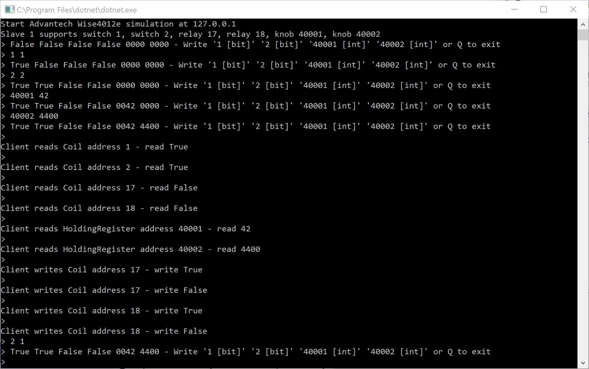

# Advantech Wise4012e Modbus Simulation

Application which simulates an Advantech Wise 4012e IO module. The application is written in .Net Core.

## Purpose

It runs a Modbus service at [127.0.0.1] (configurable):

* Switch 1 on Discrete coil 1 (read/write) 0 or 1
* Switch 2 on Discrete coil 2 (read/write) 0 or 1
* Relay 1 on Discrete coil 17 (read/write) 0 or 1
* Relay 2 on Discrete coil 18 (read/write) 0 or 1
* Knob 1 on Holding Register 40001 (read/write) 0 - 4500
* Knob 2 on Holding Register 40002 (read/write) 0 - 4500 

## Usage

This is a .Net Core application.

Compile and run this application in [Visual studio Code](https://code.visualstudio.com/).

Execute the following steps:

1. Install [.Net Core](https://www.microsoft.com/net/download/thank-you/dotnet-sdk-2.1.105-windows-x64-installer).
1. Open the folder of the project in VS Code. Select 'program.cs'. Accept any suggestions regarding debugger and packages.
1. Compile the application

    *Note*: the Debug Console is read-only. We will need to rus the app outside VS Code.

1. Go to \bin\Debug\netcoreapp2.0 folder of the project. Here you will find the \bin\Debug\netcoreapp2.0\Advantech.Wise4012e.Modbus.SimulationApp.dll

    *Note*: Do not expect an executable.

1. run the dll on the command line using the command 'dotnet Advantech.Wise4012e.Modbus.SimulationApp.dll'.

You can now read and write Modbus using this simulation in Modbus clients like [CAS Modbus Scanner](http://store.chipkin.com/articles/modbus-scanner-what-is-the-cas-modbus-scanner) or [Azure IoT Edge](https://docs.microsoft.com/en-us/azure/iot-edge/deploy-modbus-gateway).

## IoT Edge Microsoft Modbus Module

It is confirmed this simulation can be used together with the [Microsoft Azure IoT Edge Modbus Module](https://hub.docker.com/r/microsoft/azureiotedge-modbus-tcp/)

To get it working:

1. Change in the settings file the '127.0.0.1' into your local IP address
2. Start the app
3. Confirm address in the firewall for this app and port
4. Use this IP address in the Module Twin of the Modbus module 

The configuration of the device twin will look like:

    ...
    "desired": {
      "PublishInterval": "5000",
      "SlaveConfigs": {
        "Slave01": {
          "SlaveConnection": "[IP address of localhost]",
          "HwId": "Wise4012E-142ext",
          "Operations": {
            "Op01": {
              "PollingInterval": "5000",
              "UnitId": "1",
              "StartAddress": "40001",
              "Count": "1",
              "DisplayName": "KnobOne"
            },
            "Op02": {
              "PollingInterval": "5000",
              "UnitId": "1",
              "StartAddress": "40002",
              "Count": "1",
              "DisplayName": "KnobTwo"
            },
            "Op03": {
              "PollingInterval": "5000",
              "UnitId": "1",
              "StartAddress": "00001",
              "Count": "1",
              "DisplayName": "SwitchOne"
            },
            "Op04": {
              "PollingInterval": "5000",
              "UnitId": "1",
              "StartAddress": "00002",
              "Count": "1",
              "DisplayName": "SwitchTwo"
            },
            "Op05": {
              "PollingInterval": "5000",
              "UnitId": "1",
              "StartAddress": "00017",
              "Count": "1",
              "DisplayName": "RelayOne"
            },
            "Op06": {
              "PollingInterval": "5000",
              "UnitId": "1",
              "StartAddress": "00018",
              "Count": "1",
              "DisplayName": "RelayTwo"
            }
          }
        }
      },
      "$metadata": {
      ...

## Alter the behaviour of your simulation

When running the application, you can alter the values of the simulation.

Just enter:

* 1 0 (switch 1 to false)
* 1 1 (switch 1 to true)
* 2 0 (switch 2 to false)
* 2 1 (switch 2 to true)
* 17 0 (relay 1 to false)
* 17 1 (relay 1 to true)
* 18 0 (relay 2 to false)
* 18 1 (relay 2 to true)
* 40001 0-4500 (pick a value between 0 and 4500)
* 40002 0-4500 (pick a value between 0 and 4500)

*Note*: The relays can not be changed

## NModbus4 library

This simulation is making use of the Nuget package [NModbus4](https://github.com/NModbus4/NModbus4). Great work!

## Contribute

This logic is licenced under the MIT license.

Want to contribute? Throw me a pull request....

Want to know more about me? Check out my [blog](http://blog.vandevelde-online.com).

